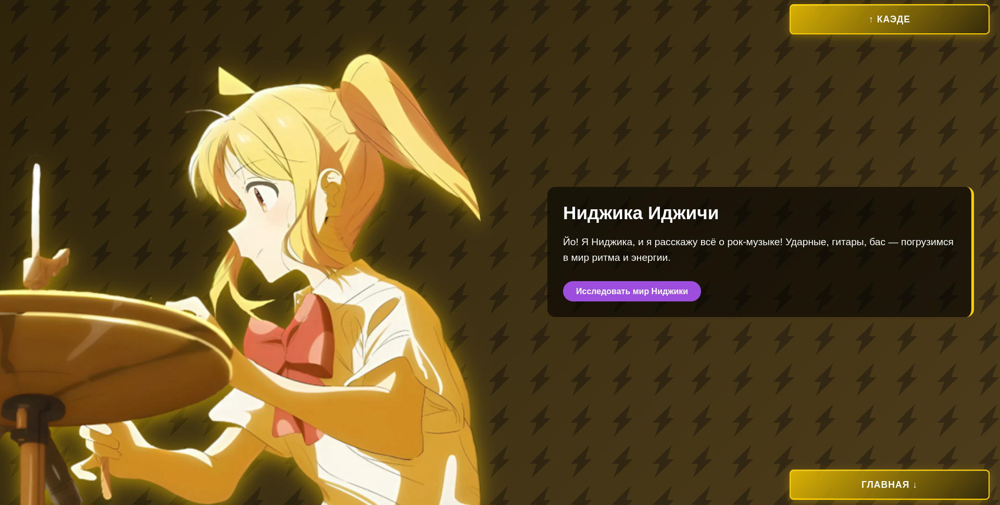
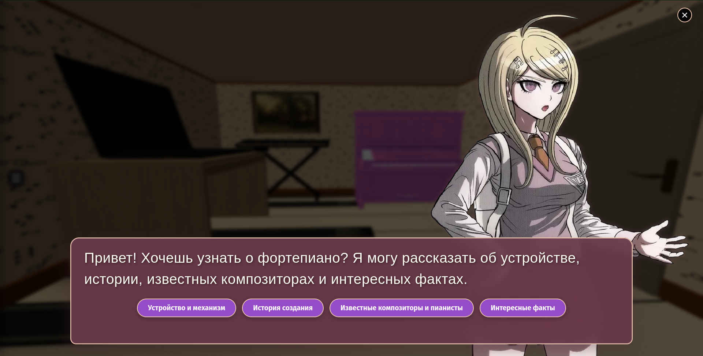
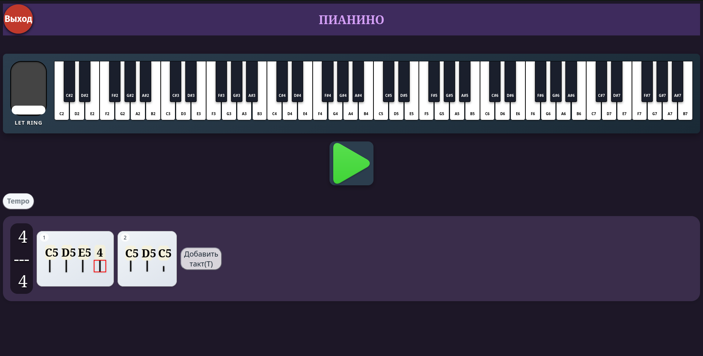

# Мир музыкальных инструментов

Интерактивный веб-сайт для изучения музыкальных инструментов и создания мелодий в формате 3D-экскурсии.  
Проект выполнен в жанре «виртуальной экскурсии» по комнатам двух персонажей — **Каэде** (клавишные и теория) и **Ниджики** (рок-музыка и ритм).  
Теперь с полноценной системой аутентификации, профилями пользователей и обратной связью.

Погрузись в атмосферу музыки, исследуй 3D-сцены, взаимодействуй с объектами, читай диалоги и сочиняй свои произведения во встроенном нотном редакторе.

## Скриншоты

| Главный экран | Комната Каэде | Нотный редактор |
|---------------|---------------|-----------------|
|  |  |  |

## Возможности

- **Две 3D-комнаты** с уникальными интерьерами и персонажами (Каэде и Ниджика).
- **Интерактивные объекты** — кликай по предметам, чтобы открывать диалоги или переходить к инструментам.
- **Система диалогов (новелла)** — персонажи рассказывают об истории, устройстве и интересных фактах об инструментах; поддерживаются ветвления и выборы.
- **Встроенный нотный редактор** для каждого инструмента:
  - Добавление/удаление нот
  - Изменение длительности (объединение/разделение)
  - Лиги
  - Настройка темпа и размера такта
  - Повторы (репризы) с указанием количества повторений
  - Воспроизведение написанной партии
- **Поддержка множества инструментов**: пианино, синтезатор, электрогитара, акустическая гитара, бас-гитара, ударная установка, флейта, скрипка.
- **Аудиосопровождение** — фоновая музыка в каждой комнате и звуки инструментов.
- **Аутентификация** — регистрация, вход, выход, просмотр профиля (имя, дата регистрации, ID).
- **Обратная связь** — пользователи могут отправлять сообщения через модальное окно; сообщения сохраняются в базе данных с типами (общее, ошибка, предложение).
- **Поиск** по инструментам с быстрым переходом.
- **Адаптивный интерфейс** с боковым меню и подсказкой поворота экрана на мобильных устройствах.
 
## Демо

Демонстрационная версия проекта доступна по адресу:  
[https://kaedecode.github.io/Nijede](https://kaedecode.github.io/Nijede)  
**!Из России могут быть проблемы к доступу на серверный хостинг Render, используйте VPN!**

## Установка и запуск

Для локального запуска потребуется как фронтенд, так и бэкенд.

### Фронтенд

1. Склонируйте репозиторий:
   ```bash
   git clone https://github.com/kaedecode/music-world.git
   ```
2. Перейдите в папку проекта:
   ```bash
   cd music-world
   ```
3. Запустите локальный сервер (например, с помощью Live Server в VS Code или Python):
   ```bash
   python -m http.server 8000
   ```
4. Откройте в браузере `http://localhost:8000`.

### Бэкенд (для полноценной работы аутентификации и обратной связи)

1. Перейдите в папку `backend` (если она отдельно) или настройте серверную часть:
   ```bash
   cd backend
   ```
2. Установите зависимости:
   ```bash
   npm install
   ```
3. Создайте файл `.env` со следующими переменными:
   ```
   PORT=3000
   DB_HOST=localhost
   DB_USER=root
   DB_PASSWORD=your_password
   DB_NAME=music_project
   SESSION_SECRET=your_secret
   CLOUDINARY_CLOUD_NAME=your_cloud_name
   CLOUDINARY_API_KEY=your_api_key
   CLOUDINARY_API_SECRET=your_api_secret
   FRONTEND_URL=http://localhost:5500
   ```
4. Примените миграции базы данных:
   ```bash
   knex migrate:latest
   ```
5. Запустите сервер:
   ```bash
   npm start
   ```
   или в режиме разработки:
   ```bash
   npm run dev
   ```

Теперь фронтенд будет обращаться к `http://localhost:3000/api` (по умолчанию). Убедитесь, что в `js/auth.js` и `js/main.js` указан правильный `API_BASE`.

Никаких дополнительных зависимостей для фронтенда не требуется — все библиотеки подключаются через CDN.

## Управление

### На главной странице и в комнатах
- **Прокрутка** между секциями осуществляется с помощью клавиш **↑ / ↓** (**W / S**) или соответствующих кнопок интерфейса.
- **Открытие бокового меню** — кнопка «☰» в левой части экрана.
- **Управление камерой** в 3D-комнатах — движение мыши (перемещение курсора меняет угол обзора).
- **Взаимодействие с объектами** — клик левой кнопкой мыши по подсвеченному предмету открывает контекстное меню с действиями (диалог, переход к инструменту, выход).

### В нотном редакторе (для всех инструментов, кроме ударных)
| Клавиша | Действие |
|---------|----------|
| **S**   | Разделить выбранную ноту (уменьшить длительность вдвое) |
| **W**   | Соединить две соседние ноты одинаковой длительности |
| **A**   | Добавить выбранную ноту в «красную» (будет выделена при воспроизведении) |
| **D**   | Сбросить выделение ноты (вернуть исходное значение) |
| **T**   | Добавить новый такт |
| **E**   | Дублировать текущий такт |
| **R**   | Удалить текущий такт |
| **→ / ←** | Сдвинуть такт вправо/влево |
| **клик по такту** | Открыть меню действий с тактом |

> Для ударных инструментов управление аналогичное, но добавление нот выполняется через всплывающее окно с выбором инструмента (клавиши 0–9, -, =).

## Архитектура проекта

Проект построен на **чистом JavaScript (ES6)** с использованием модульного подхода на фронтенде и **Node.js + Express** на бэкенде. Ключевые файлы и их назначение:

### Фронтенд
| Файл | Описание |
|------|----------|
| `js/audio.js` | Ядро нотного редактора для мелодических инструментов (пианино, гитара, флейта и т.д.). Управляет созданием тактов, нот, воспроизведением через Web Audio API. |
| `js/drumsAudio.js` | Редактор для ударной установки — работает с изображениями нот на нотоносце, поддерживает разделение/объединение длительностей и озвучивание через предзагруженные семплы. |
| `js/novel.js` | Система диалогов (новелла): отображение текста, спрайтов, выборов, аудио-вставок. Управляет очередью реплик и анимацией печати. |
| `js/dialogs.js` | Содержит все диалоговые деревья для каждой интерактивной модели (ключ — имя объекта, значение — массив диалогов). |
| `js/kaede-scene.js` и `js/nijika-scene.js` | Загрузка 3D-сцен с помощью Three.js: инициализация камеры, света, загрузка `.obj`/`.mtl` моделей, обработка наведения и кликов, контекстное меню. |
| `js/main.js` | Глобальные утилиты: управление музыкой, поиск по инструментам, модальное окно «О проекте», обратная связь. |
| `js/menu.js` | Логика бокового меню и поиска. |
| `js/auth.js` | Модуль аутентификации: регистрация, вход, выход, обновление UI, работа с сессией через localStorage. |
| `js/rotate.js` | Определение ориентации экрана и отображение подсказки поворота на мобильных устройствах. |
| `js/resource-loader.js` | Утилита для предзагрузки изображений и аудио. |

### Бэкенд (папка `backend`)
| Файл | Описание |
|------|----------|
| `app.js` | Точка входа Express-приложения: настройка CORS, сессий, helmet, маршрутов. |
| `routes/auth.js` | Маршруты регистрации, входа, выхода и получения профиля. |
| `routes/feedback.js` | Маршрут отправки обратной связи. |
| `routes/profile.js` | Маршрут обновления профиля (включая загрузку аватара в Cloudinary). |
| `controllers/authController.js` | Логика регистрации, входа, выхода, получения профиля. |
| `controllers/feedbackController.js` | Логика сохранения отзыва. |
| `controllers/profileController.js` | Логика обновления данных пользователя. |
| `models/User.js` и `models/Feedback.js` | Модели для работы с таблицами `users` и `feedback`. |
| `db.js` | Подключение к базе данных через Knex. |
| `migrations/` | Миграции для создания таблиц. |
| `middleware/auth.js` | Проверка аутентификации. |
| `middleware/cloudinaryUpload.js` | Multer-хранилище для загрузки аватаров в Cloudinary. |

**Взаимодействие модулей**:
- При клике на объект в 3D-сцене вызывается функция, которая находит соответствующий диалог в `dialogs.js` через `window.novel.show()`.
- Нотный редактор загружается отдельно на каждой странице инструмента и использует `audio.js` или `drumsAudio.js` для создания интерфейса и воспроизведения.
- Фоновая музыка управляется из `main.js` и дублируется на всех страницах через общий аудиоэлемент.
- Аутентификация: `auth.js` общается с бэкендом через `fetch`, сохраняет пользователя в `localStorage` и обновляет интерфейс.
- Обратная связь: через `main.js` отправляется POST-запрос на `/api/feedback`.

## Используемые технологии

### Фронтенд
- **HTML5 / CSS3** — семантическая разметка и стилизация (тёмная тема, анимации).
- **JavaScript (ES6)** — вся логика приложения.
- **Three.js** — 3D-рендеринг сцен, загрузка `.obj`/`.mtl` моделей.
- **Web Audio API** — синтез звука и воспроизведение аудио.
- **SweetAlert2** — красивые модальные окна.
- **Собственный аудио-движок** — для проигрывания нот и барабанов.

### Бэкенд
- **Node.js + Express** — серверная часть.
- **MySQL** — реляционная база данных (используется на хостинге ClearDB / локально).
- **Knex.js** — строитель запросов и миграции.
- **express-session** и **express-mysql-session** — управление сессиями.
- **bcrypt** — хеширование паролей.
- **Cloudinary** — хранение и обработка аватаров.
- **multer** и **multer-storage-cloudinary** — загрузка файлов.
- **cors**, **helmet** — безопасность и CORS.

## Системные требования

Для комфортной работы рекомендуется:

- **Браузер**: последняя версия Google Chrome, Firefox, Edge или Safari (с поддержкой WebGL и Web Audio API).
- **Операционная система**: Windows, macOS, Linux.
- **Разрешение экрана**: не менее 1024×768 пикселей.
- **Интернет-соединение**: требуется для загрузки моделей, аудио и взаимодействия с бэкендом (при первом запуске).
- **ОЗУ**: от 2 ГБ (для плавной работы 3D-сцен).

## Структура проекта

```
.
├── backend/                  # Серверная часть
│   ├── controllers/
│   ├── middleware/
│   ├── migrations/
│   ├── models/
│   ├── routes/
│   ├── app.js
│   ├── db.js
│   ├── knexfile.js
│   ├── package.json
│   └── .env.example
├── css/
│   ├── main.css
│   ├── menu.css
│   └── novel.css
├── index.html
├── js/
│   ├── auth.js
│   ├── dialogs.js
│   ├── kaede-scene.js
│   ├── main.js
│   ├── menu.js
│   ├── nijika-scene.js
│   ├── novel.js
│   ├── resource-loader.js
│   └── rotate.js
├── pages/
│   ├── instruments/
│   │   ├── acoustic.html
│   │   ├── audioK.css
│   │   ├── audioN.css
│   │   ├── bass.html
│   │   ├── drums.html
│   │   ├── flute.html
│   │   ├── guitar.html
│   │   ├── js/
│   │   │   ├── audio.js
│   │   │   └── drumsAudio.js
│   │   ├── piano.html
│   │   ├── synthesizer.html
│   │   └── violin.html
│   ├── kaede.html
│   └── nijika.html
├── profile.html
├── LICENSE.md
└── README.md
```

## 📜 Атрибуция и лицензии материалов

### Библиотеки и фреймворки
- **[Three.js](https://github.com/mrdoob/three.js)** — MIT License  
- **[SweetAlert2](https://github.com/sweetalert2/sweetalert2)** — MIT License  
- **[Express](https://expressjs.com/)** — MIT License  
- **[Knex.js](https://knexjs.org/)** — MIT License  
- **[bcrypt](https://github.com/kelektiv/node.bcrypt.js)** — MIT License  
- **[Cloudinary](https://cloudinary.com/)** — SDK под лицензией MIT.

### 3D-модели
Все трёхмерные модели (комнаты, мебель, инструменты) были загружены с платформы **Sketchfab** в рамках бесплатных общедоступных моделей.  
**К сожалению, мы не сохранили информацию об авторах этих моделей.**  
Если вы являетесь автором какой-либо модели, использованной в проекте, пожалуйста, свяжитесь с нами (контакты указаны в разделе «Авторы»), и мы добавим ваше имя в этот раздел или удалим модель по вашему запросу.

### Изображения и спрайты
- **Спрайты Каэде Акамацу** взяты из игры *Danganronpa V3: Killing Harmony* (© Spike Chunsoft). Используются в рамках добросовестного использования (fan project, некоммерческий характер).
- **Спрайты Ниджики Иджичи** являются обработанными кадрами из аниме *Bocchi the Rock!* (© Aki Hamaji / Houbunsha, CloverWorks). Используются в рамках добросовестного использования.
- **Фоновые текстуры** и изображения в диалогах взяты из открытых источников. Авторство большей части неизвестно.
- Остальные иконки и элементы интерфейса созданы авторами проекта.

**Если вы являетесь правообладателем и считаете, что использование материалов нарушает ваши права**, свяжитесь с нами — мы готовы удалить контент или указать корректное авторство.

### Аудио

#### Известные музыкальные произведения

| Название файла | Композиция | Автор(ы) |
|----------------|------------|----------|
| `moonlight_sonata.opus` | **«Лунная соната»** (Sonata No. 14, op. 27, № 2) | Людвиг ван Бетховен |
| `to_live_is_to_die.opus` | **«To Live Is to Die»** | Metallica (Джеймс Хэтфилд, Ларс Ульрих, Клифф Бёртон) |
| `givenUp.opus` | **«Given Up»** | Linkin Park |
| `inTheEnd.opus` | **«In the End»** | Linkin Park |
| `main_theme.opus` | **Главная тема** (из игры *Doki Doki Literature Club!*) | Дэн Сальвато (Dan Salvato) |
| `kBand.opus` | **«That Band»** (из аниме «Bocchi the Rock!») | Каёко Кусано (草野華余子); аранжировка: Рицуо Мицуи (三井律郎) |

#### Демонстрационные и учебные примеры
Остальные аудиофайлы — это **демонстрационные примеры звукового дизайна и синтеза**, созданные авторами проекта или взятые из бесплатных библиотек. Они не являются законченными музыкальными произведениями с известными авторами.

**Если вы обладаете авторскими правами на какой-либо использованный нами медиа-контент**, сообщите нам, и мы укажем авторство или удалим материал.

## Авторы

- **Александр Фролякин** — 3D-сцены, система новеллы, комната Каэде, аутентификация, обратная связь, интеграция бэкенда.  
  [GitHub](https://github.com/KaedeCode) | [Telegram](https://t.me/KaedeCode)
- **Кирилл Житников** — нотный редактор, аудиосистема, комната Ниджики.  
  [GitHub](https://github.com/arkin99-p)

---

## Лицензия

Проект распространяется под лицензией [MIT](LICENSE).  
3D-модели и звуки взяты из открытых источников. Если вы являетесь автором какого-либо материала — свяжитесь с нами для указания авторства.