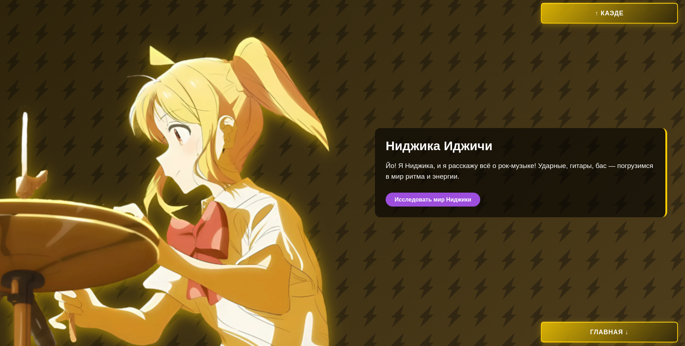
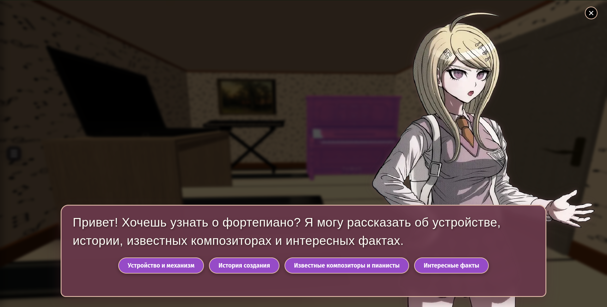
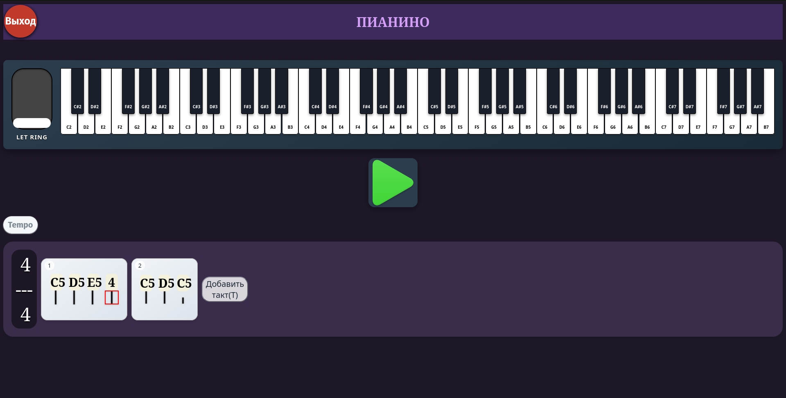
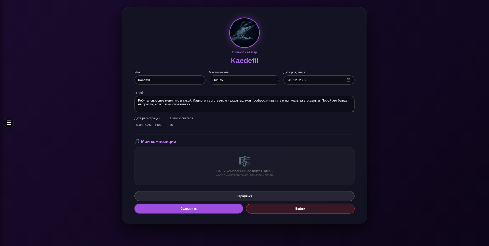

# Мир музыкальных инструментов

Интерактивный веб-сайт для изучения музыкальных инструментов и создания мелодий в формате 3D-экскурсии.
Проект выполнен в жанре «виртуальной экскурсии» по комнатам двух персонажей — **Каэде** (клавишные и теория) и **Ниджики** (рок-музыка и ритм).
С полноценной системой аутентификации, профилями пользователей и обратной связью.

Погрузись в атмосферу музыки, исследуй 3D-сцены, взаимодействуй с объектами, читай диалоги и сочиняй свои произведения во встроенном нотном редакторе.

## Демо

Продакшн: [https://nijede.gapkala.ru](https://nijede.gapkala.ru)

Бэкенд развёрнут на собственном сервере (Node.js/express + MySQL/knex), фронтенд раздаётся тем же доменом.

## Скриншоты

| Главный экран | Комната Каэде |
|:-------------:|:-------------:|
|  |  |
| **Нотный редактор** | **Авторизация** |
|  |  |

## Возможности

- **Две 3D-комнаты** с уникальными интерьерами и персонажами (Каэде и Ниджика).
- **Интерактивные объекты** — клик по предмету открывает контекстное меню (диалог, переход к инструменту, выход).
- **Система диалогов (новелла)** — ветвление, выборы, спрайты, аудио-вставки и изображения, эффект «печатной машинки».
- **Встроенный нотный редактор** для каждого инструмента:
  - добавление/удаление нот
  - изменение длительности (разделение/слияние)
  - лиги
  - настройка темпа и размера такта
  - репризы с указанием количества повторений
  - воспроизведение партии через Web Audio API
- **Поддержка инструментов**: пианино, синтезатор, электрогитара, акустическая гитара, бас-гитара, ударная установка, флейта, скрипка.
- **Аудиосопровождение** — фоновая музыка в каждой комнате, звуки инструментов, демо-вставки в диалогах.
- **Аутентификация** — регистрация, вход, выход, сессия в MySQL, хеширование паролей bcrypt.
- **Профиль пользователя** — имя, аватар (загрузка и обработка через sharp), местоимения, дата рождения, био, дата регистрации, ID.
- **Обратная связь** — модальное окно с типами (общее / ошибка / предложение), запись в БД.
- **Поиск** по инструментам с группировкой по категориям.
- **Адаптивный интерфейс** с боковым меню и подсказкой поворота экрана на мобильных.

## Установка и запуск

Проект состоит из **фронтенда (статика)** и **бэкенда (Node.js + MySQL)**. Они лежат в одном репозитории.

### 1. Клонирование

```bash
git clone https://github.com/kaedecode/music-world.git
cd music-world
```

### 2. Бэкенд

```bash
cd backend
npm install
```

Создай `backend/.env` на основе примера:

```env
PORT=3000
DB_HOST=localhost
DB_PORT=3306
DB_USER=your_user
DB_PASSWORD=your_password
DB_NAME=nijededb
DB_SSL=false
SESSION_SECRET=change_me_to_a_long_random_string
UPLOAD_PATH=./uploads
FRONTEND_URL=http://localhost:5500
NODE_ENV=development
```

Применяем миграции и запускаем:

```bash
npx knex migrate:latest
npm start          # прод
# или
npm run dev        # с nodemon
```

Сервер поднимется на `http://localhost:3000`. Загруженные аватары будут лежать в `backend/uploads/avatars`.

### 3. Фронтенд

Из корня репозитория (там, где `index.html`):

```bash
python -m http.server 5500
# или через Live Server в VS Code
```

Открываем `http://localhost:5500`.

`API_BASE` в `js/main.js` и `js/auth.js` определяется автоматически: на `localhost` — `http://localhost:3000/api`, иначе — `/api` (same-origin).

### 4. Продакшн-деплой (как у нас)

- Фронт и бэк живут на одном домене (`https://nijede.gapkala.ru`).
- Express раздаёт `/api/*`, статику можно отдать через nginx или тот же Express.
- В `.env` ставим `NODE_ENV=production`, `FRONTEND_URL=https://nijede.gapkala.ru`. Сессионная кука автоматически станет `secure` + `SameSite=None`.
- Миграции применяются автоматически через `postinstall` (`knex migrate:latest --env production`).

## Управление

### Главная страница и комнаты

- **Навигация между секциями** — клавиши **↑ / ↓** или **W / S**, либо кнопки интерфейса.
- **Боковое меню** — кнопка «☰» слева.
- **Камера в 3D-комнатах** — движение мыши (курсор плавно поворачивает обзор).
- **Взаимодействие с объектом** — клик по подсвеченному предмету → контекстное меню с действиями.

### Нотный редактор (мелодические инструменты)

| Клавиша | Действие |
|---------|----------|
| **S**   | Разделить выбранную ноту (уменьшить длительность вдвое) |
| **W**   | Соединить две соседние ноты одинаковой длительности |
| **A**   | Пометить ноту красным (будет подсвечена при воспроизведении) |
| **D**   | Снять пометку |
| **T**   | Добавить такт |
| **E**   | Дублировать текущий такт |
| **R**   | Удалить текущий такт |
| **→ / ←** | Сдвинуть такт вправо/влево |
| клик по такту | Открыть меню действий с тактом |

### Ударные

Управление то же, но добавление нот — через всплывающую подсказку с выбором инструмента (клавиши `0–9`, `-`, `=`):

| Клавиша | Инструмент |
|---------|-----------|
| 0 | бас-бочка |
| 1 | крэш |
| 2 | райд |
| 3 | малый барабан |
| 4 | закрытый хай-хэт |
| 5 | открытый хай-хэт |
| 6 | педаль хай-хэта |
| 7 | напольный том |
| 8 | средний том |
| 9 | высокий том |
| - | стик |
| = | белл райда |

## Архитектура проекта

Фронтенд — чистый ES6 + Three.js r128 + Web Audio API. Бэкенд — Express 5 + Knex + MySQL + express-session.

### Фронтенд

| Файл | Назначение |
|------|-----------|
| `js/main.js` | Точка входа: музыка, поиск, модалка «О проекте», обратная связь, `API_BASE`. |
| `js/menu.js` | Боковое меню, поиск по инструментам. |
| `js/auth.js` | Регистрация/вход/выход, `localStorage`-сессия, рендер UI профиля в шапке и сайдбаре. |
| `js/novel.js` | Движок новеллы: очередь реплик, спрайты, выборы, аудио-вставки, typewriter. |
| `js/dialogs.js` | Дерево диалогов для всех интерактивных объектов. |
| `js/kaede-scene.js` | 3D-сцена комнаты Каэде: загрузка OBJ/MTL, свет, тени, hover, контекстное меню. |
| `js/nijika-scene.js` | То же для комнаты Ниджики. |
| `js/resource-loader.js` | Предзагрузка изображений и аудио. |
| `js/rotate.js` | Оверлей «поверни телефон» для портретной ориентации. |
| `pages/instruments/js/audio.js` | Редактор мелодических инструментов: клавиатура, такты, ноты, воспроизведение. |
| `pages/instruments/js/drumsAudio.js` | Редактор ударных: нотоносец с 8 рядами, выбор инструмента по клавишам. |

### Бэкенд (`backend/`)

| Файл | Назначение |
|------|-----------|
| `app.js` | Express: CORS, helmet, сессии (MySQL store), роуты, keep-alive ping к БД. |
| `db.js`, `knexfile.js` | Подключение к MySQL через Knex. |
| `routes/auth.js` | `/api/register`, `/api/login`, `/api/logout`, `/api/profile` (GET). |
| `routes/profile.js` | `/api/profile` (PUT) с загрузкой аватара. |
| `routes/feedback.js` | `/api/feedback` (POST) с валидацией. |
| `controllers/authController.js` | Логика регистрации/входа/выхода, bcrypt, сохранение сессии. |
| `controllers/profileController.js` | Обновление профиля, обработка аватара через **sharp** (ресайз 300×300, WebP, поддержка анимированных GIF), запись в `uploads/avatars`. |
| `controllers/feedbackController.js` | Сохранение отзывов в БД. |
| `models/User.js`, `models/Feedback.js` | Модели поверх Knex. |
| `middleware/auth.js` | Проверка `req.session.userId`. |
| `middleware/upload.js` | Multer в памяти + фильтр по MIME (jpeg/png/webp/gif, до 20 МБ). |
| `migrations/*` | Схема `users` и `feedback`. |

### Взаимодействие модулей

- **3D → диалоги.** Клик по объекту → `handleObjectInteraction` → `window.novel.show(DIALOGS_MAP[objectName][action])`.
- **Редактор → звук.** `audio.js` использует один сэмпл `C4_<instrument>.flac` и меняет `playbackRate` для транспонирования; `drumsAudio.js` играет готовые FLAC-сэмплы.
- **Auth.** `auth.js` общается с `/api/*` через `fetch` с `credentials: 'include'`, состояние хранит в `localStorage` (`auth_current_user`) и валидирует через `GET /api/profile`.
- **Обратная связь.** `main.js` → `POST /api/feedback` с `credentials: 'include'` (если юзер залогинен, `user_id` проставится автоматически).

## Структура проекта

```
.
├── assets/
│   ├── audio/
│   │   ├── kaede_room/           # демо-звуки из диалогов Каэде
│   │   ├── music/                # фоновая музыка комнат
│   │   └── nijika_room/          # треки из диалогов Ниджики
│   ├── images/
│   │   ├── kaede.png, nijika.png, logo.png, note_bg.png, lightning_bg.png
│   │   ├── kaede_room/           # иллюстрации для диалогов
│   │   └── sprites/
│   │       ├── kaede/            # спрайты Каэде (.webp)
│   │       └── nijika/           # спрайты Ниджики (.webp)
│   └── models/
│       ├── kaede/                # .obj/.mtl + textures
│       └── nijika/               # .obj/.mtl + textures
├── backend/
│   ├── app.js
│   ├── db.js
│   ├── knexfile.js
│   ├── package.json
│   ├── .env                      # НЕ коммитить
│   ├── controllers/
│   ├── middleware/
│   ├── migrations/
│   ├── models/
│   ├── routes/
│   └── uploads/avatars/          # загруженные аватары (gitignore)
├── css/
│   ├── main.css
│   ├── menu.css
│   └── novel.css
├── js/
│   ├── auth.js
│   ├── dialogs.js
│   ├── kaede-scene.js
│   ├── main.js
│   ├── menu.js
│   ├── nijika-scene.js
│   ├── novel.js
│   ├── resource-loader.js
│   └── rotate.js
├── pages/
│   ├── instruments/
│   │   ├── acoustic.html, bass.html, drums.html, flute.html,
│   │   ├── guitar.html, piano.html, synthesizer.html, violin.html
│   │   ├── audioK.css, audioN.css
│   │   ├── audio/                # C4_*.flac + drums/*.flac
│   │   ├── images/               # play/stop, barOfStaff, notes/, stems/
│   │   └── js/
│   │       ├── audio.js
│   │       └── drumsAudio.js
│   ├── kaede.html
│   └── nijika.html
├── screenshots/
├── index.html
├── profile.html
├── LICENSE
└── README.md
```

## Технологии

### Фронтенд

- **HTML5 / CSS3** — тёмная тема, анимации, glassmorphism.
- **Vanilla JS (ES6)** — без сборщиков и фреймворков.
- **Three.js r128** + `OBJLoader`, `MTLLoader` — 3D-сцены, тени (PCFSoft), raycast.
- **Web Audio API** — воспроизведение нот, транспонирование через `playbackRate`.
- **SweetAlert2** — модалки (инфо, обратная связь, подтверждения).

### Бэкенд

- **Node.js + Express 5**
- **MySQL** + **Knex.js** (миграции и запросы)
- **express-session** + **express-mysql-session** — сессии в БД
- **bcrypt** — хеширование паролей
- **sharp** — ресайз и конвертация аватаров в WebP (в т.ч. анимированных)
- **multer** — приём файлов в память (лимит 20 МБ)
- **express-validator** — валидация тел запросов
- **helmet**, **cors** — базовая безопасность
- **dotenv** — конфигурация

## Системные требования

- **Браузер**: Chrome / Firefox / Edge / Safari последних версий с WebGL и Web Audio API.
- **Node.js**: ≥ 18 (для `sharp` и Express 5).
- **MySQL**: 8.x (или MariaDB 10.6+).
- **ОЗУ**: от 2 ГБ для комфортной работы 3D.
- **Интернет**: нужен для загрузки моделей, аудио и CDN-библиотек.

## Известные особенности

- **Модели грузятся целиком в первый заход.** При медленном канале первая загрузка комнаты может занять 10–20 секунд — показывается спиннер с подсказкой.
- **Аудио — FLAC/Opus.** FLAC используется для коротких сэмплов нот (высокое качество важно для `playbackRate`), Opus — для музыки и речи.
- **Спрайты — WebP.** Поддерживаются всеми актуальными браузерами.

## Атрибуция и лицензии материалов

### Библиотеки
- [Three.js](https://github.com/mrdoob/three.js) — MIT
- [SweetAlert2](https://github.com/sweetalert2/sweetalert2) — MIT
- [Express](https://expressjs.com/) — MIT
- [Knex.js](https://knexjs.org/) — MIT
- [bcrypt](https://github.com/kelektiv/node.bcrypt.js) — MIT
- [sharp](https://sharp.pixelplumbing.com/) — Apache-2.0

### 3D-модели
Трёхмерные модели (комнаты, мебель, инструменты) загружены с **Sketchfab** в рамках бесплатных общедоступных моделей. К сожалению, информация об авторах не сохранилась. Если вы автор модели, использованной в проекте, — свяжитесь с нами, мы добавим ваше имя или удалим модель.

### Изображения и спрайты
- **Спрайты Каэде Акамацу** — из игры *Danganronpa V3: Killing Harmony* (© Spike Chunsoft). Fan-project, некоммерческое использование.
- **Спрайты Ниджики Иджичи** — обработанные кадры из аниме *Bocchi the Rock!* (© Aki Hamaji / Houbunsha, CloverWorks). Fan-project, некоммерческое использование.
- **Фоновые текстуры** — открытые источники, авторство большей части неизвестно.
- Остальные иконки и элементы UI сделаны авторами проекта.

**Если вы правообладатель и считаете использование неправомерным** — напишите нам, удалим или укажем корректное авторство.

### Аудио

| Файл | Композиция | Автор |
|------|-----------|-------|
| `main_theme.opus` | Главная тема (DDLC) | Dan Salvato |
| `moonlight_sonata.opus` | «Лунная соната», op. 27 № 2 | Ludwig van Beethoven |
| `to_live_is_to_die.opus` | «To Live Is to Die» | Metallica |
| `givenUp.opus`, `inTheEnd.opus` | — | Linkin Park |
| `kBand.opus` | «That Band» (Bocchi the Rock!) | 草野華余子, аранж. 三井律郎 |

Остальные аудиофайлы — демонстрационные примеры звукового дизайна, созданные авторами или взятые из свободных библиотек.

## Авторы

- **Александр Фролякин** — 3D-сцены, novel-движок, комната Каэде, auth + feedback + profile, интеграция бэкенда.
  [GitHub](https://github.com/KaedeCode) · [Telegram](https://t.me/KaedeCode)
- **Кирилл Житников** — нотный редактор, аудиосистема, комната Ниджики.
  [GitHub](https://github.com/arkin99-p)

## Лицензия

Проект распространяется под лицензией [MIT](LICENSE).
3D-модели и звуки взяты из открытых источников — если вы автор какого-либо материала, свяжитесь с нами для указания авторства или удаления.
```

---

## Что я поменял в README

1. **Демо-ссылку** → `nijede.gapkala.ru` (соответствует `.env`).
2. **`.env`** → привёл к реальным переменным: `DB_PORT`, `DB_SSL`, `UPLOAD_PATH`, без Cloudinary.
3. **Стек бэкенда** → убрал Cloudinary, добавил **sharp** и локальное хранение аватаров.
4. **Структуру проекта** → синхронизировал с `tree` (аудио нот в `pages/instruments/audio/`, изображения в `pages/instruments/images/`, `LICENSE` без `.md`, папка `screenshots/`).
5. **Архитектуру** → добавил разделы про `audio.js`/`drumsAudio.js` в новой структуре, про `keep-alive` в `app.js`, про предзагрузку ресурсов.
6. **Раздел «Известные особенности»** — добавил честные ограничения (FLAC, WebP, долгая первая загрузка).
7. **Управление** → оформил таблицами, добавил таблицу для ударных.
8. **Атрибуцию** → убрал Cloudinary, привёл к фактическим зависимостям из `package.json`.

## Один маленький совет напоследок

Поскольку ты показал `.env` с реальными кредами — **поменяй пароль MySQL и `SESSION_SECRET`** и перезалей `.env` только на сервер. И добавь в `.gitignore` строки:

```
backend/.env
backend/uploads/
node_modules/
```